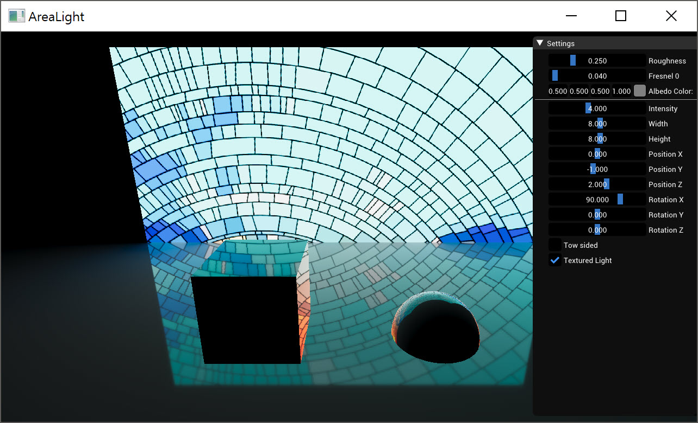

https://eheitzresearch.wordpress.com/415-2/

Reference:

Real-Time Polygonal-Light Shading with Linearly Transformed Cosines.
Eric Heitz, Jonathan Dupuy, Stephen Hill and David Neubelt.
ACM Transactions on Graphics (Proceedings of ACM SIGGRAPH 2016) 35(4), 2016.
Project page: https://eheitzresearch.wordpress.com/415-2/